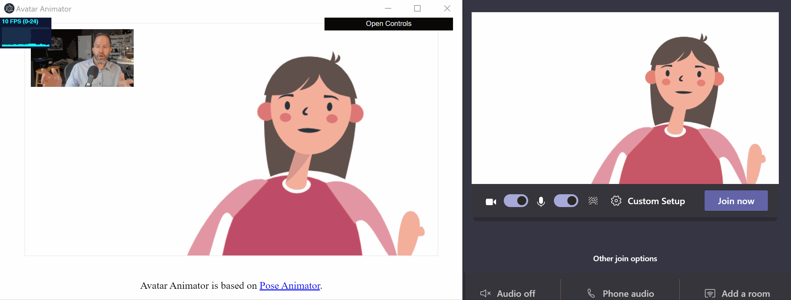

<!-- omit in toc -->
# Avatar Animator

Avatar Animator is a tool for generating real-time 2D vector-based avatar animations using webcams or other video devices. It can be used with Zoom, Skype, Microsoft Team, Google Meet, and many more video-conferencing apps. The project is a fork of [Pose Animator](https://github.com/yemount/pose-animator), a fast and real-time 2D vector illustrations animator based on Google's [PoseNet](https://github.com/tensorflow/tfjs-models/tree/master/posenet) and [FaceMesh](https://github.com/tensorflow/tfjs-models/tree/master/facemesh) model. It wraps Pose Animator in an Electron app and sends it to a virtual camera.

**Demo of Avatar Animator using Microsoft Teams**. In case you are curious, for the demo above, instead of using a real webcam as the input source to Avatar Animator, the input is simulated with [OBS Studio](https://obsproject.com/) and [OBS-VirtualCam](https://github.com/Fenrirthviti/obs-virtual-cam) from a [YouTube video](https://www.youtube.com/watch?v=x_lHk9Lf-ow), leading to the following processing chain: YouTube (browser) 🠚 OBS Studio (desktop capture) 🠚 OBS-VirtualCam (1) 🠚 Avatar Animator 🠚 OBS-VirtualCam (2) 🠚 Microsoft Teams. Why? Just for fun...

<!-- omit in toc -->
## Table of Contents
- [Supported platforms](#supported-platforms)
- [Prerequisites](#prerequisites)
- [Installation](#installation)
- [Getting started](#getting-started)
- [Development notes](#development-notes)
- [Copyright and license](#copyright-and-license)

## Supported platforms

**Currently, only Windows is supported.** If you would like Avatar Animator on other platforms, mark your interest with 👍 in the [macOS](https://github.com/letmaik/avatar-animator/issues/3) or [Linux](https://github.com/letmaik/avatar-animator/issues/4) issue page.

## Prerequisites

Download and install the following prerequisites:

- [OBS Studio](https://obsproject.com/download)
- OBS-VirtualCam for [Windows](https://github.com/Fenrirthviti/obs-virtual-cam/releases)

## Installation

Download and unzip the latest version of Avatar Animator from the [release page](https://github.com/letmaik/avatar-animator/releases).

## Getting started

From the Avatar Animator folder, launch `avatar-animator.exe` before your preferred video-conferencing apps and select `OBS-Camera` as your input stream in your video-conferencing application settings. Examples on how to do this for common video-conferencing apps are given in the table below:

| Application    | Procedure                                                                                                                                     | Screenshot |
| --------------- | --------------------------------------------------------------------------------------------------------------------------------------------- | ---------- |
| Zoom            | Go to `Settings` -> `Video` and select `OBS-Camera` from the `Camera` drop-down menu.                                                         | TODO       |
| Skype           | Go to `Settings` -> `Audio & Video` and select `OBS-Camera` from the `Camera` drop-down menu.                                                 | TODO       |
| Microsoft Teams | Click on your profile picture at the top of Teams, then `Settings` -> `Devices` and select `OBS-Camera` from the `Camera` drop-down menu.     | TODO       |
| Google Meet     | Start a meeting, then click `Settings` > `General` and select `OBS-Camera` from the `Camera` drop-down menu.                                  | TODO       |
| Slack           | Start a call, then click on the gear icon in the top left corner of the call window and select `OBS-Camera` from the `Camera` drop-down menu. | TODO       |

## Development notes

See [DEVELOP.md](DEVELOP.md).

## Copyright and license

Copyright notice is stated at the top of source files. Source code released under [Apache-2.0](LICENSE). Binary releases are currently released under [GPL-2.0](LICENSE_BIN) to conform with the licence requirement of [node-virtualcam](https://github.com/letmaik/node-virtualcam), also released under GPL-2.0.
